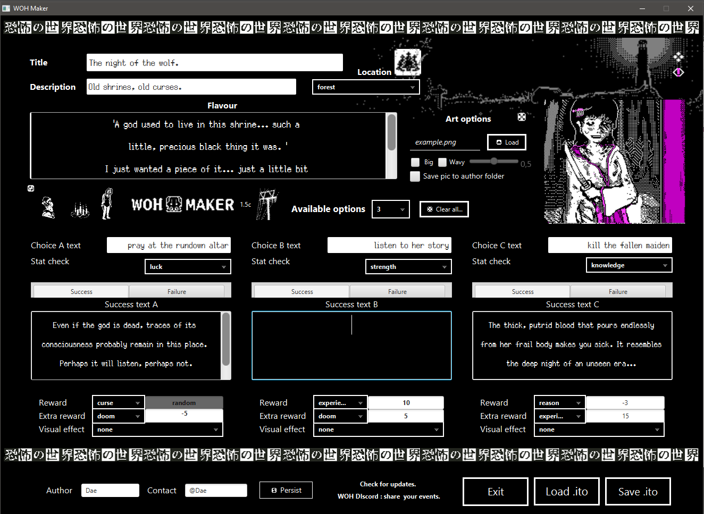

# WOHMakerEV

World of Horror custom event creation tool.

Download links: 

Windows: <b>[Download WOHMaker 1.5b for Windows](WOHMaker1.5b.zip?raw=true)</b> [08/06/2020]

MacOS test build: <b>[Download WOHMaker 1.4 for macOS](WOHMaker1.4%20macOS%20bundled%20JRE.zip?raw=true)</b> [07/06/2020]

**Version 1.5b**
- Fixed memory leak in autocompletion bindings for loaded events.
- When saving an event, "failure" related tags won't be written if the check type is "story".
- Added confirmation dialog when selecting "save picture to user folder", if current image is already in a subfolder.

**Version 1.5**
- Added icons for each location.
- Rewards which take integer values will not accept text, and will default to 0.
- Improved behaviour of reward/extra-reward controls.
- Improved layout and fixed some UI issues here and there.

**Version 1.4b:**
- Added option to save the event image to a sepparate user folder.
- Saved events won't cause crashes in macOS when leaving empty fields.
- Improved parsing of ito files (i.e : loading an event with an injury will now display the "random" string, "´" char now supported)
- Other small fixes and tweaks.

**Version 1.4:**
- You can now drag ito files over the exe to load them.
- You can now set ito files to "open with -> WOHMaker" 
- Text for intro and outcomes now looks as it will look in the game.
- Improved demeanor of "hide warnings" button.
- Optimized code and dependencies.

**Version 1.3b:**
- Now features a proper windows executable
- Removed white band
- Improved "image not found" img

**Version 1.3:**
- Improved behaviour when loading events.
- Corrected an issue which could prevent pictures to be saved alongside event.
- Better feedback when failing to load image.
- Added button to hide all warnings.
- Improved UI arts, layout and CSS styles.
- Other fixes and tweaks.

**Version 1.2:**
- Corrected an issue which prevented events without art to be saved.
- Improved layout and UI elements.
- Added button to reset art to default.

**Version 1.1:**
- Improved overall visuals and layout for better legibility
- Fixed most ui issues
- Corrected names for items and spells.
- removed global location (currently not working in woh)

Features:

    Create, read, edit and save WOH's event files (.ito) easily.
    All current (0.9.14) features implemented (extra_rewards, itempools, global, wavy art, spells...).
    OnScreen help and tips, reward autocompletion and warning messages (text length, image resolution) to lower chance of errors.
    Automatic pathing for files and images. Choose the pic you want for your event and the program will put it were it must.

Requirements:

    Windows OS, preferably WINDOWS 10.
    1366x768 minimum resolution.

Known issues:

    [None right now]
    
TO DO:
    
    Make UI rezisable and adjust better to different resolutions.
    Make it so sta/rea/doom/funds rewards take only integers as value.
    Implement new features as they are being provided by the game.
    Provide launcher for linux/macOS.

Technical:
    
    Written in Java 11, JavaFX 14.0.1. Compiled, ran and released as jLink image through javafx-maven-plugin.

Credits and thanks:

    Silver font which is used in certain parts of the UI is the work of PoppyWorks (https://poppyworks.itch.io/silver).

    Thanks to: 
    Mythical, for providing asset lists and general help.
    Throdax, for coding advices and collaboration.
